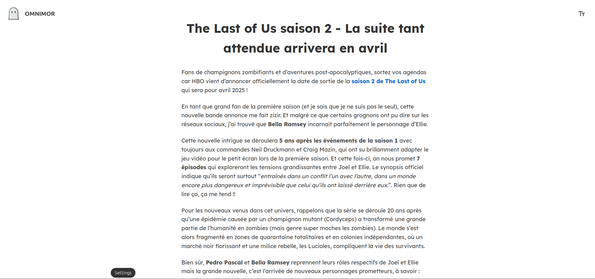

# Omnimor - Your Personal Web Article Manager


## Overview
Omnimor is a self-hosted web article management solution born from the sunset of Omnivore. It aims to provide a seamless experience for saving, and reading web articles.





## Key Features
- 📑 Save articles from any URL
- 🎯 Clean reading experience
- 📱 Responsive grid and list views
- 🗑️ Easy article management
- 🔍 Full-text search (coming soon)
- 🏷️ Tags and categories (coming soon)

## Tech Stack

### Frontend
- React.js for the UI
- Axios for API communication
- CSS Modules for styled components

### Backend
- Node.js & Express.js
- PostgreSQL database
- @mozilla/readability for article parsing
- JSDOM for HTML processing

## Getting Started

### Prerequisites
- Docker and Docker Compose

### Installation Options

#### Option 1: Docker (Recommended)
1. Create a `docker-compose.yaml` file with the following content:
```yaml
services:
  db:
    image: postgres:16
    ports:
      - "5432:5432"
    volumes:
      - omnimor_db_data:/var/lib/postgresql/data
    environment:
      POSTGRES_USER: postgres
      POSTGRES_PASSWORD: mysecretpassword
      POSTGRES_DB: postgres
      POSTGRES_PORT: 5432
    healthcheck:
      test: ["CMD-SHELL", "pg_isready -U postgres -d postgres"]
      interval: 5s
      timeout: 5s
      retries: 5
      start_period: 10s
      
  omnimorapi:
    image: omnimorapi:latest
    ports:
      - "4000:4000"
    environment:
      DB_USER: postgres
      DB_PASSWORD: mysecretpassword
      DB_NAME: postgres
      DB_HOST: db
      API_PORT: 4000
    depends_on:
      db:
        condition: service_healthy

  omnimorapp:
    image: omnimorapp:latest
    ports:
      - "3000:3000"
    environment:
      APP_PORT: 3000
    depends_on:
      - omnimorapi

volumes:
  omnimor_db_data: {}
```

2. Run the application:
```bash
docker-compose up -d
```

The application will be available at:
- Frontend: http://localhost:3000
- API: http://localhost:4000
- Database: localhost:5432

#### Option 2: Manual Setup
1. Navigate to the `omnimorapi` directory
2. Create a `.env` file with your database credentials:
```
DB_USER=your_username
DB_HOST=localhost
DB_NAME=your_database_name
DB_PASSWORD=your_password
DB_PORT=5432
```

Note: The database table will be created automatically when the API starts. If you're using Docker, the environment variables are already configured in the docker-compose.yaml file.

### Configuration du Backend
### Backend Setup
1. Navigate to the `omnimorapi` directory
2. Create a `.env` file with your database credentials:
```
DB_USER=votre_utilisateur
DB_HOST=localhost
DB_NAME=nom_de_votre_base
DB_PASSWORD=votre_mot_de_passe
DB_PORT=5432
```
3. Install dependencies:
```bash
npm install
```
4. Start the server:
```bash
npm start
```


## Usage Guide
1. Launch the application
2. Click the "Add" button in the sidebar
3. Paste any article URL to save it
4. Browse your articles in grid or list view
5. Click on any article to open the reader view
6. Use the toolbar for article management

## Project Structure
```tree
omnimor/
│
├── omnimorapp/           # Frontend React
│   ├── public/         
│   │   └── assets/     # Assets
│   └── src/
│       └── components/ # React Components and CSS Files
│
└── omnimorapi/          # Backend Express

```

## Contribution
Contributions are welcome! Feel free to:
- Report bugs
- Suggest new features
- Contribute to the code
## Licence
This project is licensed under the MIT License - see the LICENSE file for details.

## Author
Lila JACQUET-CRETIDES- 2025
